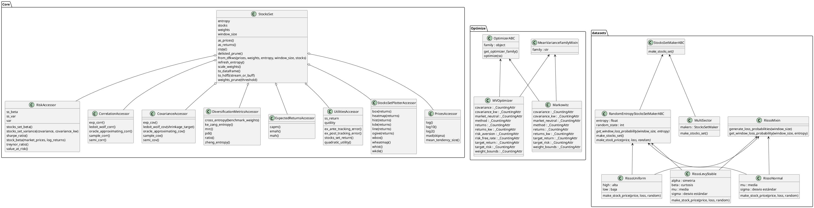

# Welcome to GARPAR


> _Generación y análisis de retornos de portafolios artificiales y reales_
>
> Generation and analysis of artificial and real portfolio returns

-------------------------------------------
## Pasos para correr el proyecto

Primero se debera tener instalado cmake y hdf5, cualquier otro problema de dependencias fuera de los de python estan contemplados por el usuario que instala Garpar

`git clone git@github.com:quatrope/garpar.git`

Luego de clonar el repositorio:

```
pip install build

python -m build 

pip install dist/garpar-0.1-py3-none-any.whl
```

Para development usar

```
python -m venv .venv

source .venv/bin/activate

pip install -r requirements_dev.txt
```

## Diagrama de clases de Garpar


