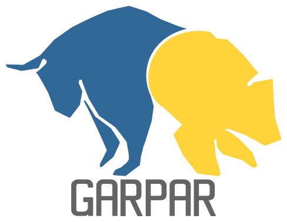

# Welcome to GARPAR




> _Generación y análisis de retornos de portafolios artificiales y reales_
>
> Generation and analysis of artificial and real portfolio returns

-------------------------------------------

<!-- BODY -->

[](https://github.com/quatrope/garpar/actions/workflows/CI.yml)
[](https://garpar.readthedocs.io/en/latest/)
## Introduction

Generation and analysis of artificial and real portfolio returns.

A comprehensive toolset for analyzing and managing financial portfolios/markets
through the StocksSet class. Provides functionality for portfolio/market
optimization, risk assessment, and performance analysis.

Key Features:

- Portfolio/market construction and rebalancing
- Risk metrics calculation (variance, VaR, etc.)
- Expected returns estimation
- Correlation and covariance analysis
- Diversification metrics
- Portfolio/market visualization tools
- Market data handling and validation
- Entropy-based analysis


## Contact

**You can contact me at:**

- <diego.gimenez@unc.edu.ar>
- <jbcabral@unc.edu.ar>

## Support

[](https://www.buymeacoffee.com/leliel12)


## Code Repository & Issues

<https://github.com/quatrope/garpar>

## License

Garpar is under
[MIT License](https://raw.githubusercontent.com/quatrope/garpar/master/LICENSE.txt)

This license allows unlimited redistribution for any purpose as long as
its copyright notices and the license's disclaimers of warranty are
maintained.

## Citation

If you are using Garpar in your research, please cite:

> Nothing yet

Bibtex entry:


```bibtex
    Nothing yet
```

**Full Publication:**
